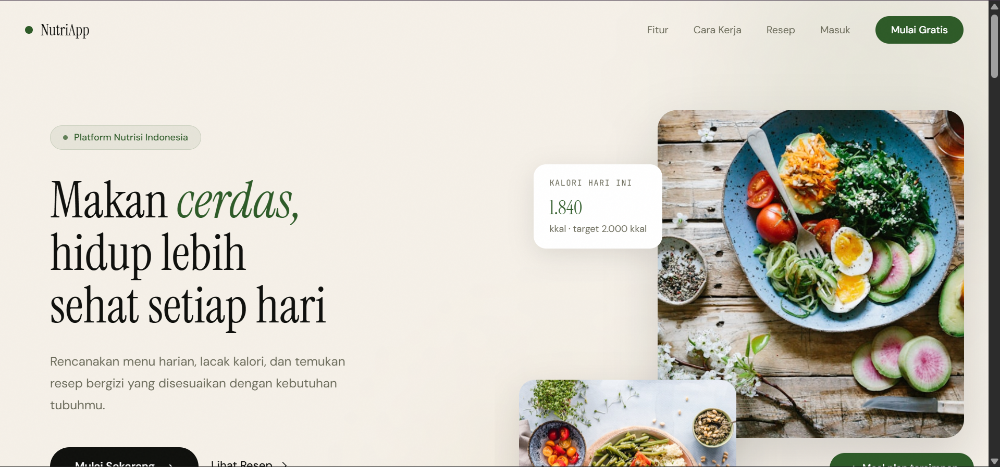
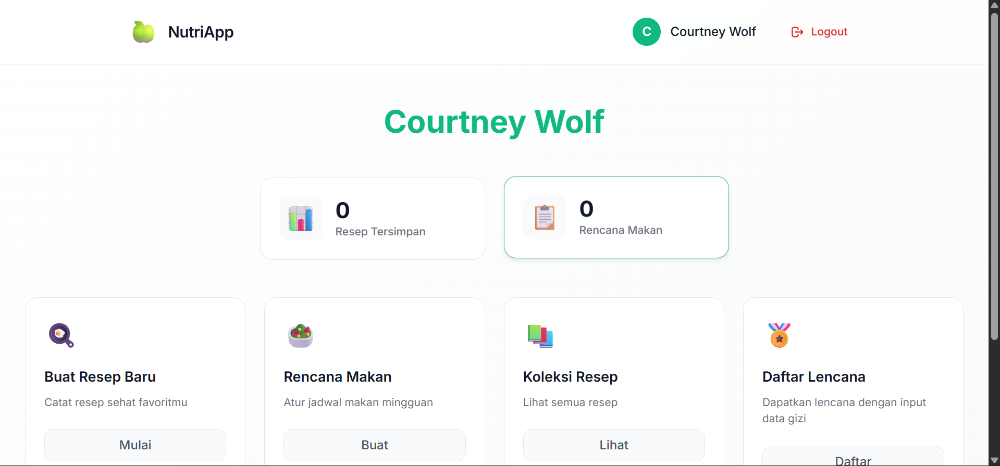
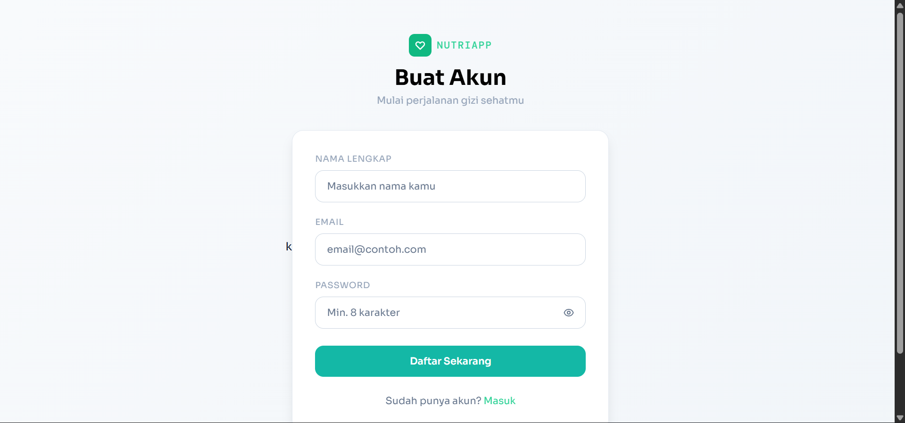

# 🍎 NutriApp - Aplikasi Manajemen Nutrisi

Aplikasi web untuk membantu pengguna melacak asupan nutrisi harian dan mencapai tujuan kesehatan mereka.

## 📸 Screenshots

### Landing Page


### Dashboard


### Register Page


## ✨ Fitur Utama

- 📊 **Dashboard Interaktif** - Pantau asupan nutrisi harian dengan visualisasi yang informatif
- 👤 **Manajemen Pengguna** - Registrasi dan login yang aman
- 🥗 **Tracking Nutrisi** - Catat dan pantau konsumsi makanan sehari-hari

## 🚀 Teknologi yang Digunakan

- **Backend**: FastAPI (Python)
- **Database**: SQLAlchemy + PostgreSQL
- **Frontend**: HTML, CSS, JavaScript
- **Authentication**: JWT
- **Deployment**: Uvicorn

## 📋 Prasyarat

Sebelum menjalankan aplikasi, pastikan Anda memiliki:

- Python 3.8+
- PostgreSQL (atau SQLite untuk development)
- Git

## 🔧 Instalasi

1. Clone repository
```bash
git clone https://github.com/Abong-123/nutriapp.git
cd nutriapp

2. Buat Virtual Environment
python -m venv venv
- source venv/bin/activate          # Linux/Mac
- source venv\Scripts\activate      # Windows

3. Install semua isi requirement.txt
pip install -r requirements.txt


